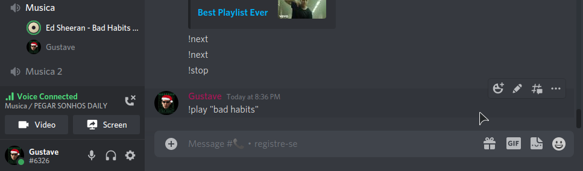

# Discord Music Bot

Discord bot that plays youtube videos, made with music in focus

Inspired by Rhythm bot, but with the purpose to be used as a template to the servers create their own versions,

In this way will be very difficult to Google shut down each server's Bot

## Commands

### !play
```
!play [link | search query | playlist link] [options]
```
The first parameter you can put the link of the video or playlist or a search for the video using " "

##### Example
```
!play https://www.youtube.com/watch?v=orJSJGHjBLI
!play "bad habits"
```

The second is opcional, it can be:
<br>*loop* : make video play in loop
<br>*shuffle* : shuffle the playlist before play it

#### Example

```
!play https://www.youtube.com/watch?v=orJSJGHjBLI loop
!play https://www.youtube.com/watch?v=hT_nvWreIhg&list=PLbZIPy20-1pN7mqjckepWF78ndb6ci_qi shuffle
```

When playing a music, the bot change its nickname to the name of the music(first 32 characters)



### !next and !previous
These commands go to the next or previous music in the playlist

Ps: The bot automatically go to the next music when it finish, <br>but it has a limit of 100 musics, that can be changed in the code(not recommended with low memory)

##### Example

```
!next
!previous
```

### !stop
Stop to playing the music and reset the nickname

## How To Use

First you have to go the developers section of discord and create a Bot and pick the token

Second create a "config.json" file with this code
``` 
{
    "token": "your token here"
}
```

Finally run this command

Yarn<br>
```yarn start```<br>
NPM<br>
``` npm run start```

PS: pm2 must be installed to work  

Or<br>
``` node main.js```